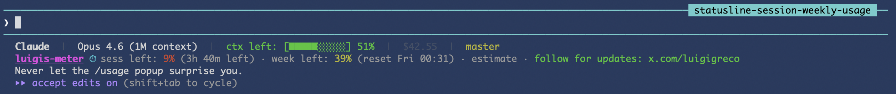

# luigis-meter

[\](https://github.com/Luigigreco/luigis-meter)

> Know exactly how much Claude Code runway you have — 5h session and weekly —
> before the `/usage` popup would tell you. Statusline-native, calibratable, MIT.

**luigis-meter** is a terminal-native quota indicator for Claude Code Max
users. It reads your local transcripts, estimates how much of your 5-hour
session and weekly Max plan quota is still available, and surfaces it right
in your statusline. No more `/usage` popup hunting.



## Why

Claude Code's built-in `/usage` popup is great — but it's a popup. You have
to interrupt your flow, type a command, read numbers, close it. If you work
intensely enough to hit Max plan limits, you want that information **always
visible**, not one keystroke away.

luigis-meter puts the gauge where you already look: your statusline.

## Features

- ⏱ **Session 5h remaining** — with countdown to reset
- 📅 **Weekly remaining** — with reset day/time
- 🎨 **Color-coded** — green (safe), yellow (watch), red (danger)
- 🚀 **Fast** — 30s cache, <10ms on warm reads
- 📦 **Zero runtime deps** — bash, jq, awk, find, date. Already on macOS/Linux.
- 🔧 **Calibratable** — override defaults via environment variables
- 🏷️ **Brand-visible** — `luigis-meter` prefix identifies the tool at a glance

## Install

### One-liner

```bash
curl -sSL https://raw.githubusercontent.com/Luigigreco/luigis-meter/main/install.sh | bash
```

This downloads `luigis-meter.sh` into `~/.claude/scripts/` and prints the
snippet to paste into your existing `~/.claude/statusline.sh`. It never
overwrites files without asking.

### Manual

```bash
mkdir -p ~/.claude/scripts
curl -o ~/.claude/scripts/luigis-meter.sh \
  https://raw.githubusercontent.com/Luigigreco/luigis-meter/main/luigis-meter.sh
chmod +x ~/.claude/scripts/luigis-meter.sh
```

Then add to your `~/.claude/statusline.sh`, just before the final `echo`:

```bash
METER_LINE=$(bash ~/.claude/scripts/luigis-meter.sh 2>/dev/null)
```

And after the final `echo`:

```bash
[ -n "$METER_LINE" ] && echo -e "$METER_LINE"
```

If you don't have a `statusline.sh` yet, see `examples/statusline.sh.example`
for a minimal starting point.

## Output format

Calibrated (you've set your own ceilings):

```
luigis-meter ⏱ sess left: 85% (≈2h 13m est.) · week left: 39% (reset Fri 14:00) · local est. (not /usage)
```

Uncalibrated (out of the box — no guessed numbers):

```
luigis-meter ⏱ sess: calibrate (≈2h 13m est.) · week: calibrate (reset Fri 14:00) · local est. (not /usage)
```

| Part                      | Meaning                                       |
| ------------------------- | --------------------------------------------- |
| `luigis-meter`            | brand prefix — clickable link to this repo    |
| `⏱`                      | visual marker for the meter line              |
| `sess left: N%`           | percent of the 5-hour session block remaining |
| `sess: calibrate`         | shown until you set `CLAUDE_MAX_5H_TOKENS`    |
| `(≈Nh Nm est.)`           | estimated time until the 5-hour block resets  |
| `week left: N%`           | percent of the weekly quota remaining         |
| `(reset Fri HH:MM)`       | next weekly reset (fixed at Fri 14:00 local)  |
| `local est. (not /usage)` | reminder that these are local estimates       |

Colors follow "remaining" semantics: green >50%, yellow 20-50%, red <20%.

## Calibration (required for percentages)

**luigis-meter ships no guessed numbers.** Anthropic does not publish exact
Max-plan token ceilings, so out of the box the meter shows `calibrate` instead
of a percentage that would only look authoritative. To get percentages, set
your own measured ceilings:

```bash
export CLAUDE_MAX_5H_TOKENS=...       # your real 5h ceiling
export CLAUDE_MAX_WEEKLY_TOKENS=...   # your real weekly ceiling
```

**Ceiling-capture method (recommended):** when Claude Code's `/usage` shows
~100% used, run the meter with `CLAUDE_METER_DEBUG=1` and read the deduped raw
token sum it prints to stderr — that sum _is_ your real ceiling for that window.
Plug it into the env vars above. See [CALIBRATION.md](docs/CALIBRATION.md) for
the full procedure, and consider sharing your values via the
[calibration issue template](https://github.com/Luigigreco/luigis-meter/issues/new?template=calibration.yml).

### Optional toggles

```bash
CLAUDE_METER_INCLUDE_SIDECHAINS=1   # 1 (default) counts sub-agent/Task turns; 0 excludes
CLAUDE_METER_DEBUG=1                # print deduped raw token sums to stderr
```

Excluding sidechains makes the estimate **optimistic** (Anthropic almost
certainly bills sub-agent turns), so the safe default counts them.

## FAQ

**Q: Why is the 5h countdown marked `≈` and `est.`?**

A: It's an estimate. Anthropic's real 5h block starts from your **first
message** and closes 5h later. luigis-meter has no access to that server-side
start, so it anchors the countdown to a fixed 5-hour grid on the clock instead.
That keeps the countdown **monotonic** (it only ticks down, never jumps back up
as it did in earlier versions) at the cost of being off the real block boundary
by up to ~5h. The `≈ … est.` marker is there so you never mistake it for ground
truth — only `/usage` is.

**Q: Why does it show `calibrate` instead of a percentage?**

A: Because you haven't told it your real quota yet, and it refuses to show a
made-up number. Anthropic doesn't publish exact Max-plan ceilings, so any
shipped default would be a guess dressed up as data. Set `CLAUDE_MAX_5H_TOKENS`
and `CLAUDE_MAX_WEEKLY_TOKENS` (see Calibration above) and the percentages
appear.

**Q: Is the weekly reset really on Fridays?**

A: Anthropic uses a rolling 7-day window under the hood, but the `/usage`
popup displays "Resets Fri HH:MM" as a human-friendly approximation.
luigis-meter mirrors that format for familiarity. The number of tokens
used in the last 7 days is what actually matters, not the exact day.

**Q: Why don't you count `cache_read_input_tokens`?**

A: Cache tokens are heavily discounted in real Anthropic billing (Claude
Code uses prompt caching aggressively). Including them would inflate
percentages 10-20x and make the meter wildly wrong. Only `input_tokens +
output_tokens` are counted.

**Q: Can this push me over the limit faster by running frequently?**

A: No. The script only **reads** local JSONL files that already exist. It
makes zero API calls to Anthropic. Running it every second costs nothing.

**Q: What if Anthropic changes the Max plan limits?**

A: Your calibrated env values go stale. Re-run the ceiling-capture method (see
Calibration) and update them. There are no hardcoded numbers to wait on.

## How it works

luigis-meter scans `~/.claude/projects/**/*.jsonl` (Claude Code's local
transcript files), sums `input_tokens + output_tokens` from the last 5 hours
and 7 days, and — when calibrated — divides by your quota ceilings.

Claude Code writes **one JSONL line per content block** in a turn (thinking,
text, each tool call), and they all carry the same `requestId` and usage
payload. luigis-meter **deduplicates by `requestId`** (keeping the largest token
count seen for each, since the final streamed total is authoritative), so a
single multi-block turn is counted once — not 3-6×. Without this, heavy sessions
overcount by ~60%.

This is **not** a connection to Anthropic's servers. It's a local estimate
based on data Claude Code already writes to disk. Quality depends on
calibration.

### What is counted

- `.message.usage.input_tokens` + `.message.usage.output_tokens`, deduplicated
  by `requestId` (fallback: `uuid`, then per-line)
- sub-agent / Task ("sidechain") turns, by default — toggle with
  `CLAUDE_METER_INCLUDE_SIDECHAINS=0`

### What is NOT counted

- `cache_read_input_tokens` (heavily discounted in real billing)
- `cache_creation_input_tokens` (one-off, distorts short windows)
- Tool call overhead and server tool tokens (not exposed in transcripts)

## Limitations

- **Not authoritative**: Anthropic's `/usage` popup uses server-side data.
  This tool uses local transcripts. They can diverge.
- **5h reset is a grid estimate**: anchored to a fixed 5h clock grid, not your
  real first-message block start — off by up to ~5h (marked `≈ … est.`).
- **Weekly reset is approximated**: Anthropic uses a rolling 7-day window;
  the displayed "Fri 14:00" mirrors the `/usage` popup's format.
- **Needs calibration**: shows `calibrate` until you set your ceilings.
- **Single-tier counting**: Sonnet and Opus tokens are summed together.

## Show it off

Using luigis-meter? Add this badge to your README and give the tool a home on
your projects:

[\](https://github.com/Luigigreco/luigis-meter)

Markdown to copy-paste:

```markdown
[\](https://github.com/Luigigreco/luigis-meter)
```

Every badge is a backlink. Every backlink makes the next user discover the tool.
Thank you for keeping the runway visible.

## Community

luigis-meter is part of the Claude Code power-user ecosystem. Worth
following for updates, tips, and related tools:

- [@luigigreco on X](https://x.com/luigigreco) — creator, tool updates
- [@ClaudeCodeLog on X](https://x.com/ClaudeCodeLog) — Claude Code changelog bot
- [@tom_doerr on X](https://x.com/tom_doerr) — community tools and experiments
- [@bcherny on X](https://x.com/bcherny) — Claude Code creator (Anthropic)

If you build something on top of luigis-meter or fork it into a variant,
tag `@luigigreco` — I'd love to see it.

## Roadmap

- [x] Initial release
- [x] Brand visible in output (`luigis-meter` prefix)
- [x] requestId dedup + ceiling-capture calibration (no guessed defaults)
- [x] Monotonic 5h countdown + fixed weekly reset time
- [x] FAQ for confusing edge cases
- [ ] Homebrew tap (`brew install luigigreco/meter/luigis-meter`)
- [ ] Community-contributed calibration dataset for Max 5x / Pro tiers
- [ ] Alert mode (`notify-send` when `sess left < 10%`)
- [ ] Split Sonnet / Opus counters (if Anthropic publishes split limits)

## Contributing

Calibration data is gold. If your numbers diverge from `/usage`, open a
[calibration issue](https://github.com/Luigigreco/luigis-meter/issues/new?template=calibration.yml)
with:

- Your plan (Max 5x / Max 20x / Pro)
- Real "used" percentages from `/usage`
- luigis-meter percentages at the same moment
- Your tuned env var values (if any)

The more data points we collect, the better the defaults get for everyone.

## License

MIT. Use it, fork it, rebrand it. If you build something cool on top, I'd
love to hear about it: [@luigigreco on X](https://x.com/luigigreco).

## Credits

- Built by [Luigi Greco](https://github.com/Luigigreco) — because the
  `/usage` popup was never enough.
- Inspired by [ccusage](https://github.com/ryoppippi/ccusage), which solves
  a different slice of the same problem.

---

_A tool from Luigi — built in a terminal, for people who live in a terminal._
