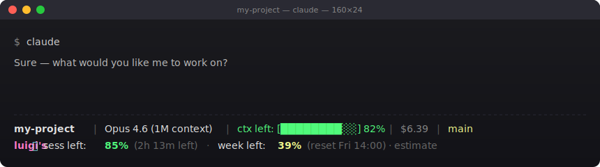

# luigis-meter

> The Claude Code Max quota meter, live in your statusline.
> Know when you're burning fuel before you run out.

**luigis-meter** is a terminal-native quota indicator for Claude Code Max
users. It reads your local transcripts, estimates how much of your 5-hour
session and weekly Max plan quota is still available, and surfaces it right
in your statusline. No more `/usage` popup hunting.



## Why

Claude Code's built-in `/usage` popup is great — but it's a popup. You have
to interrupt your flow, type a command, read numbers, close it. If you work
intensely enough to hit Max plan limits, you want that information **always
visible**, not one keystroke away.

luigis-meter puts the gauge where you already look: your statusline.

## Features

- ⏱ **Session 5h remaining** — with countdown to reset
- 📅 **Weekly remaining** — with reset day/time
- 🎨 **Color-coded** — green (safe), yellow (watch), red (danger)
- 🚀 **Fast** — 30s cache, <10ms on warm reads
- 📦 **Zero runtime deps** — bash, jq, awk, find, date. Already on macOS/Linux.
- 🔧 **Calibratable** — override defaults via environment variables
- 🏷️ **Brand-visible** — `luigi's` prefix identifies the tool at a glance

## Install

### One-liner

```bash
curl -sSL https://raw.githubusercontent.com/Luigigreco/luigis-meter/main/install.sh | bash
```

This downloads `luigis-meter.sh` into `~/.claude/scripts/` and prints the
snippet to paste into your existing `~/.claude/statusline.sh`. It never
overwrites files without asking.

### Manual

```bash
mkdir -p ~/.claude/scripts
curl -o ~/.claude/scripts/luigis-meter.sh \
  https://raw.githubusercontent.com/Luigigreco/luigis-meter/main/luigis-meter.sh
chmod +x ~/.claude/scripts/luigis-meter.sh
```

Then add to your `~/.claude/statusline.sh`, just before the final `echo`:

```bash
METER_LINE=$(bash ~/.claude/scripts/luigis-meter.sh 2>/dev/null)
```

And after the final `echo`:

```bash
[ -n "$METER_LINE" ] && echo -e "$METER_LINE"
```

If you don't have a `statusline.sh` yet, see `examples/statusline.sh.example`
for a minimal starting point.

## Output format

```
luigi's ⏱ sess left: 85% (2h 13m left) · week left: 39% (reset Fri 14:00) · estimate
```

| Part                | Meaning                                       |
| ------------------- | --------------------------------------------- |
| `lm`                | brand prefix — this is luigis-meter           |
| `⏱`                | visual marker for the meter line              |
| `sess left: N%`     | percent of the 5-hour session block remaining |
| `(Nh Nm left)`      | time until the current 5-hour block resets    |
| `week left: N%`     | percent of the weekly quota remaining         |
| `(reset Fri HH:MM)` | next weekly reset                             |
| `estimate`          | reminder that these are local estimates       |

Colors follow "remaining" semantics: green >50%, yellow 20-50%, red <20%.

## Defaults (Max 20x)

These defaults were calibrated from real Max 20x usage and match
Claude Code's `/usage` popup within ~2% on the tester's setup:

```bash
CLAUDE_MAX_5H_TOKENS=192000       # ~192K tokens per 5h block
CLAUDE_MAX_WEEKLY_TOKENS=3250000  # ~3.25M tokens per week
```

If the numbers drift for you, see [CALIBRATION.md](docs/CALIBRATION.md)
for the retuning procedure, and consider sharing your tuned values via
the [calibration issue template](https://github.com/Luigigreco/luigis-meter/issues/new?template=calibration.yml).

## FAQ

**Q: Why does my `sess left` show high % but `(0h 0m left)` or `(resetting...)`?**

A: Not a bug. Claude Code's 5-hour session block starts from your **first
message** in the current window and closes 5 hours later regardless of how
much you used. If you sent one message 4h59m ago and then nothing, you'll
see high "remaining" but imminent reset. This matches the `/usage` popup
exactly.

**Q: Why are the defaults tuned for Max 20x specifically?**

A: That's the tier the original author uses. Max 5x and Pro users should
expect the defaults to drift significantly — please retune via
[CALIBRATION.md](docs/CALIBRATION.md) and consider opening a calibration
issue so the community can converge on per-tier defaults.

**Q: Is the weekly reset really on Fridays?**

A: Anthropic uses a rolling 7-day window under the hood, but the `/usage`
popup displays "Resets Fri HH:MM" as a human-friendly approximation.
luigis-meter mirrors that format for familiarity. The number of tokens
used in the last 7 days is what actually matters, not the exact day.

**Q: Why don't you count `cache_read_input_tokens`?**

A: Cache tokens are heavily discounted in real Anthropic billing (Claude
Code uses prompt caching aggressively). Including them would inflate
percentages 10-20x and make the meter wildly wrong. Only `input_tokens +
output_tokens` are counted.

**Q: Can this push me over the limit faster by running frequently?**

A: No. The script only **reads** local JSONL files that already exist. It
makes zero API calls to Anthropic. Running it every second costs nothing.

**Q: What if Anthropic changes the Max plan limits?**

A: The hardcoded defaults will go stale. Either wait for a new release
that updates them, or retune via env vars yourself. Calibration issues
are the mechanism for catching drift quickly.

## How it works

luigis-meter scans `~/.claude/projects/**/*.jsonl` (Claude Code's local
transcript files), sums `input_tokens + output_tokens` from the last 5
hours and 7 days, and divides by the quota limits.

This is **not** a connection to Anthropic's servers. It's a local estimate
based on data Claude Code already writes to disk. Quality depends on
calibration.

### What is counted

- `.message.usage.input_tokens`
- `.message.usage.output_tokens`

### What is NOT counted

- `cache_read_input_tokens` (heavily discounted in real billing)
- `cache_creation_input_tokens` (one-off, distorts short windows)
- Tool call overhead and server tool tokens (not exposed in transcripts)

## Limitations

- **Not authoritative**: Anthropic's `/usage` popup uses server-side data.
  This tool uses local transcripts. They can diverge.
- **Weekly reset is approximated**: Anthropic uses a rolling 7-day window.
- **Limits drift over time**: If Anthropic changes Max plan quotas, the
  hardcoded defaults will go stale. Recalibrate periodically.
- **Single-tier counting**: Sonnet and Opus tokens are summed together.

## Community

luigis-meter is part of the Claude Code power-user ecosystem. Worth
following for updates, tips, and related tools:

- [@luigigreco on X](https://x.com/luigigreco) — creator, tool updates
- [@ClaudeCodeLog on X](https://x.com/ClaudeCodeLog) — Claude Code changelog bot
- [@tom_doerr on X](https://x.com/tom_doerr) — community tools and experiments
- [@bcherny on X](https://x.com/bcherny) — Claude Code creator (Anthropic)

If you build something on top of luigis-meter or fork it into a variant,
tag `@luigigreco` — I'd love to see it.

## Roadmap

- [x] Initial release
- [x] Brand visible in output (`luigi's` prefix)
- [x] Calibrated defaults from real Max 20x data
- [x] FAQ for confusing edge cases
- [ ] Homebrew tap (`brew install luigigreco/meter/luigis-meter`)
- [ ] Community-contributed calibration dataset for Max 5x / Pro tiers
- [ ] Alert mode (`notify-send` when `sess left < 10%`)
- [ ] Split Sonnet / Opus counters (if Anthropic publishes split limits)

## Contributing

Calibration data is gold. If your numbers diverge from `/usage`, open a
[calibration issue](https://github.com/Luigigreco/luigis-meter/issues/new?template=calibration.yml)
with:

- Your plan (Max 5x / Max 20x / Pro)
- Real "used" percentages from `/usage`
- luigis-meter percentages at the same moment
- Your tuned env var values (if any)

The more data points we collect, the better the defaults get for everyone.

## License

MIT. Use it, fork it, rebrand it. If you build something cool on top, I'd
love to hear about it: [@luigigreco on X](https://x.com/luigigreco).

## Credits

- Built by [Luigi Greco](https://github.com/Luigigreco) — because the
  `/usage` popup was never enough.
- Inspired by [ccusage](https://github.com/ryoppippi/ccusage), which solves
  a different slice of the same problem.

---

_A tool from Luigi — built in a terminal, for people who live in a terminal._
